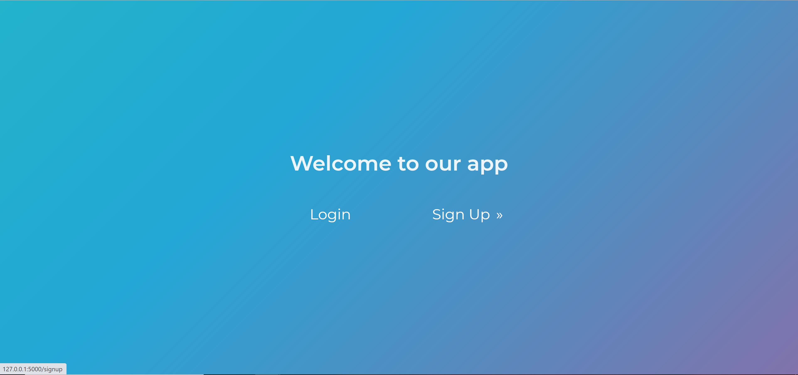
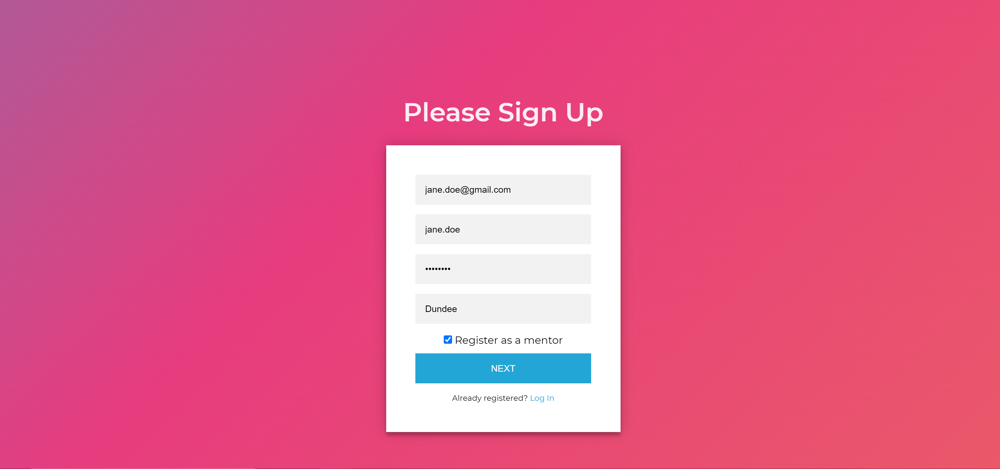
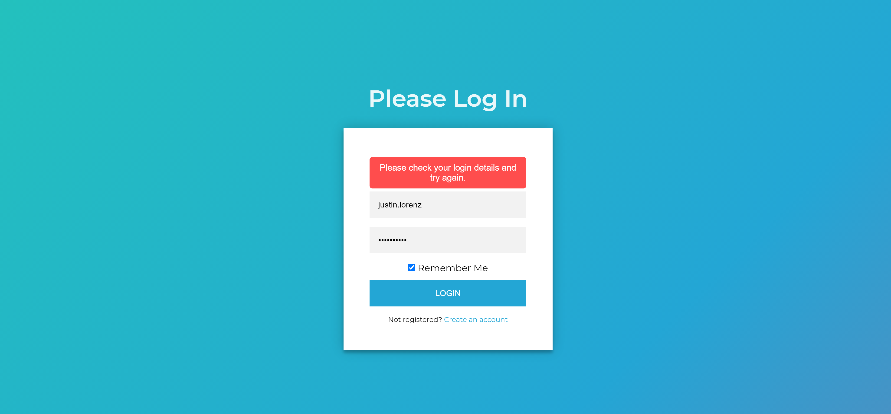
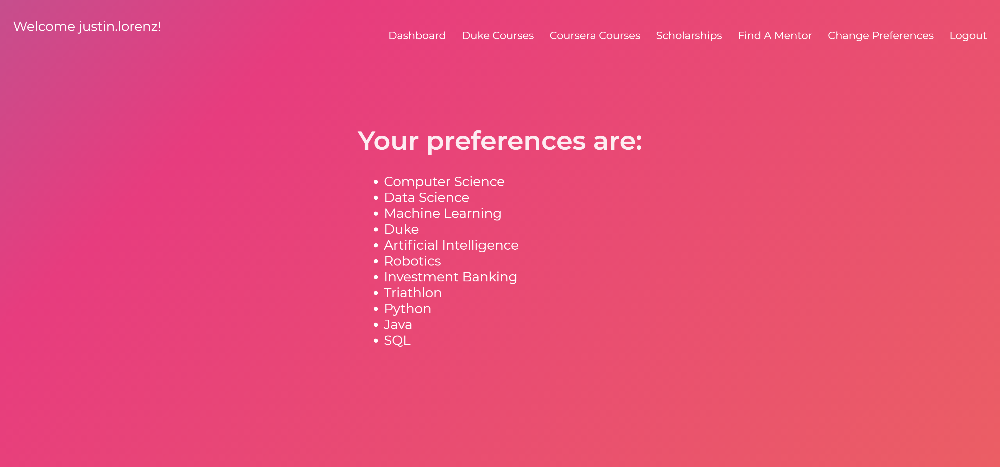
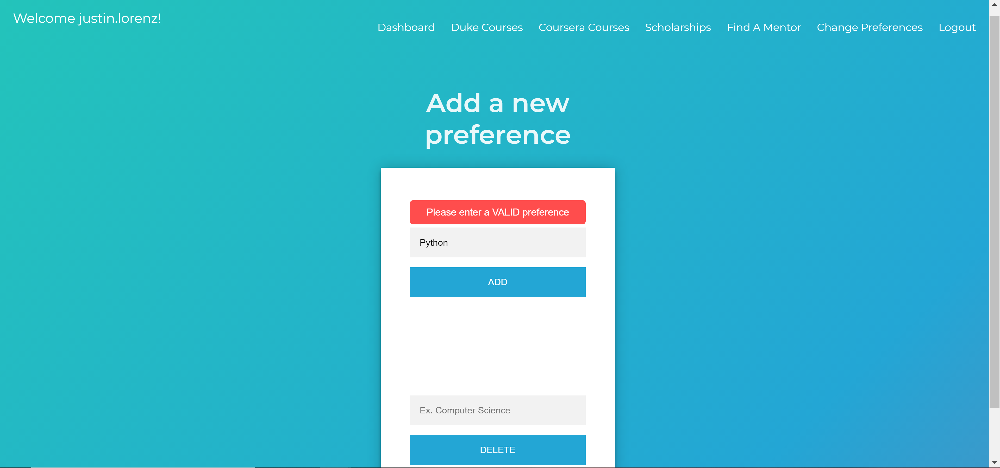
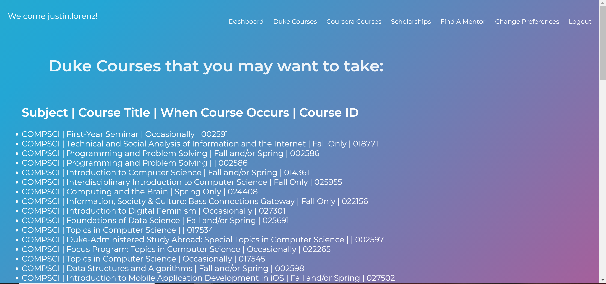
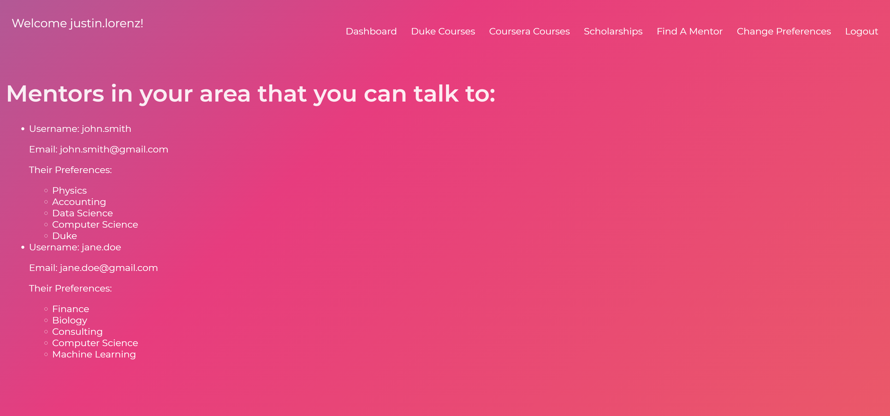

# HackDuke Web App - Cognoscere 

## How To Run:

First login to your own virtual environment or use the one provided in the repo. Then set/export the FLASK_APP=__init__.py, and then you can use flask run to launch the local flask server.

## Main Aim/Goal:

This web app was created during the HackDuke hackathon and was focusing on the education track. The idea of this project was to allow students from different communities to learn about opportunities that are available to them by just inputting what types of preferences they have. The overall goal was to provide users with options to learn more about things such as available courses, mentors available to talk, scholarships, etc.

## Features:
* SQL Database that holds current information about all past and present users
* Login Authentication System
* Utilization of Duke's APIs to find matching courses
* Webscraping script that can generate a CSV of info about Coursera courses

## Photos:

